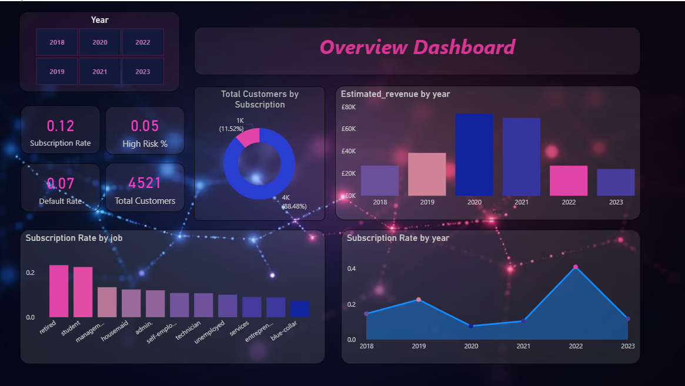
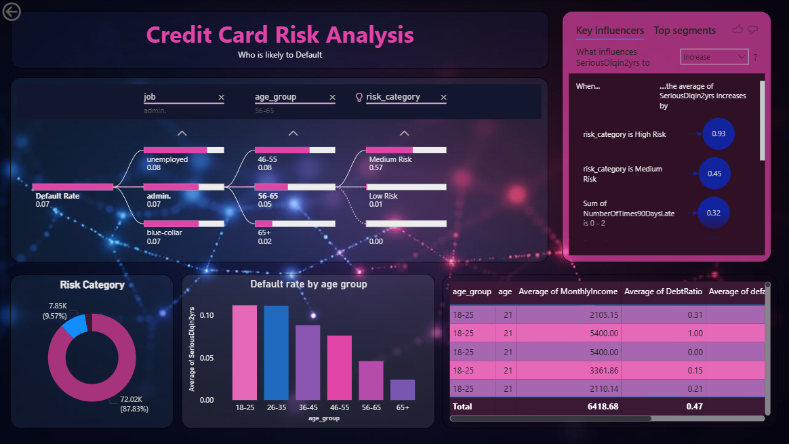

# UK Banking Risk Intelligence Dashboard

## Overview
An end-to-end banking risk intelligence project that combines 
three real-world datasets, builds a machine learning model to 
predict customer loan default risk, and presents findings in a 
professional 6-page interactive Power BI dashboard.

This project demonstrates the full data analyst workflow — from 
raw data ingestion and cleaning, through exploratory analysis and 
SQL querying, to machine learning and business intelligence reporting.

---

## Problem Statement
Banks lose millions every year when customers default on loans. 
The goal of this project is to identify which customers are most 
likely to default — and why — so the bank can make smarter 
lending decisions before issuing credit.

---

## Tools & Technologies

| Tool | Purpose |
|---|---|
| Python (pandas, numpy) | Data cleaning and merging |
| Python (seaborn, matplotlib) | Exploratory data analysis |
| Python (scikit-learn) | Random Forest ML model |
| SQLite | SQL queries inside notebook |
| Power BI | 6-page interactive dashboard |
| DAX | Custom measures and calculations |
| Power Query | Data transformation on import |
| GitHub | Version control and portfolio |

---

## Datasets

| Dataset | Source | Rows | Description |
|---|---|---|---|
| bank-full.csv | UCI Machine Learning Repository | 45,211 | Bank marketing campaign customer data |
| cs-training.csv | Kaggle — Give Me Some Credit | 150,000 | Loan default history |
| uk_economic.csv | Manually compiled | 7 | UK economic indicators 2017-2023 |

> Note: cs-training.csv must be downloaded separately from Kaggle
> due to file size. uk_economic.csv is included in the data folder.

---

## Project Structure
---

## Methodology

### Step 1 — Data Cleaning (Python)
- Fixed semicolon delimiter issue in bank dataset
- Handled missing values using median imputation
- Removed invalid age entries (age = 0)
- Capped revolving utilisation at 1.0
- Created age_group and year columns for joining

### Step 2 — Data Merging (Python)
- Merged bank marketing data with UK economic indicators on year
- Created age_group column across both datasets for joining
- Exported 3 clean CSV files for Power BI

### Step 3 — Exploratory Data Analysis (Python)
- Answered 5 business questions with seaborn visualisations
- Built correlation heatmap across all numeric features
- Ran 5 SQL queries using SQLite in-memory database

### Step 4 — Machine Learning (Python)
- Trained Random Forest Classifier on 8 financial features
- Used class_weight='balanced' to handle imbalanced data (93/7 split)
- Evaluated model using classification report and AUC score
- Added default_risk_score (0-1) and risk_category to dataset

### Step 5 — Power BI Dashboard
- Built star schema connecting 3 tables in Model view
- Wrote 4 custom DAX measures
- Built 6-page interactive dashboard with slicers, drill-through,
  bookmarks, decomposition tree, key influencers and tooltips

---

## Key Findings

1. **Students aged 26-35 classified as High Risk defaulted at 95%**
   — nearly 14x the overall portfolio default rate of 7%

2. **Revolving credit utilisation is the strongest default predictor**
   — customers using over 60% of available credit are 3.4x more 
   likely to default regardless of income level

3. **Past payment behaviour predicts future default better than income**
   — customers with zero 90-day late payments have a 37 percentage 
   point lower default rate

4. **May to August is the strongest campaign window**
   — generating the majority of subscriptions despite covering 
   only 4 months of the year

5. **The ML model is validated by Power BI independently**
   — Key Influencers visual identified the same top risk factors 
   as the Random Forest feature importance scores

---

## Dashboard Pages

| Page | Title | Key Visuals |
|---|---|---|
| 1 | Executive Overview | KPI cards, line chart, bar chart, slicer |
| 2 | Credit Risk Analysis | Decomposition tree, key influencers, donut chart, table |
| 3 | Campaign Performance | Waterfall chart, line + column chart, drill-through |
| 4 | Economic Context | Dual axis line chart, area chart, Q&A visual |
| 5 | Customer Segments | Scatter chart, matrix heatmap, bookmarks |
| 6 | Tooltip Page | Custom hover popup for all pages |

---

## Screenshots

### Page 1 — Executive Overview

### Page 2 — Credit Risk Analysis

---

## How to Run

1. Clone this repository
2. Download cs-training.csv from Kaggle (Give Me Some Credit)
3. Place it in the data/ folder
4. Open notebooks/analysis.ipynb in Jupyter
5. Run all cells — this will generate all cleaned CSV files
   and save the trained model to models/
6. Open powerbi/banking_dashboard.pbix in Power BI Desktop

---

## Note on Large Files
The trained model file (default_risk_model.pkl) exceeds GitHub's 
100MB file size limit and is excluded from this repository. 
Running the notebook will regenerate it automatically in under 
5 minutes.

---

## Author
**Fannana Fahreen Aanan**  
Aspiring Data Analyst  
[GitHub](https://github.com/fannanafahreen)
